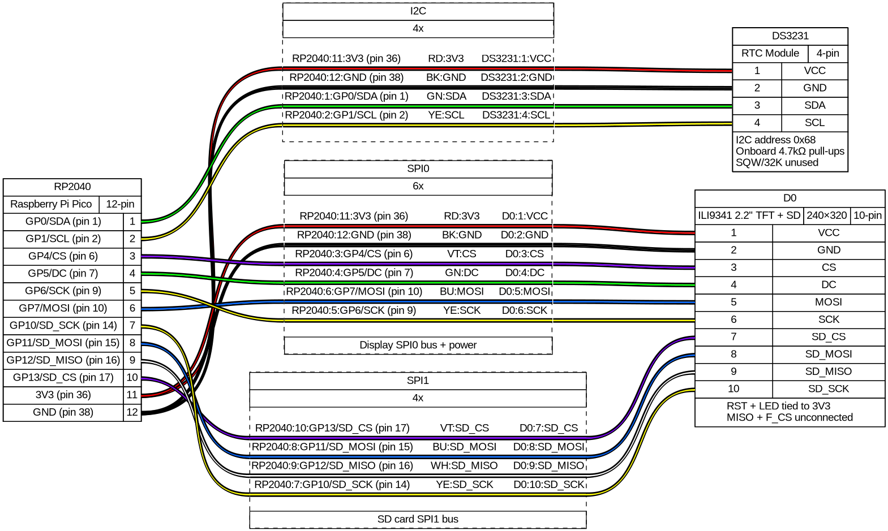

# System design

This project is about creating a 4-digit clock.
Each digit is a separate display displaying images.

## Hardware

* uC — RP2040 running CircuitPython >10.0
* RTC — DS3231
* Display — 2.2" TFT ILI9341 (240×320, SPI) with onboard SD card slot
* SD card — on display module, connected via SPI1

Source: [tinytronics](https://www.tinytronics.nl/en/displays/tft/2.2-inch-tft-display-240*320-pixels-ili9341)

## Wiring

[PINOUT](https://www.raspberrypi.com/documentation/microcontrollers/pico-series.html#pico-1-family)

| RP2040 Pin | Bus | Device Pin | Function |
|------------|-----|------------|----------|
| GP0 (pin 1) | I2C0 SDA | DS3231 SDA | I2C data |
| GP1 (pin 2) | I2C0 SCL | DS3231 SCL | I2C clock |
| GP4 (pin 6) | — | Display CS | Chip select |
| GP5 (pin 7) | — | Display DC | Data/Command select |
| GP6 (pin 9) | SPI0 SCK | Display SCK | SPI clock |
| GP7 (pin 10) | SPI0 TX | Display MOSI | SPI data out |
| GP10 (pin 14) | SPI1 SCK | SD_SCK | SD card clock |
| GP11 (pin 15) | SPI1 TX | SD_MOSI | SD card data out |
| GP12 (pin 16) | SPI1 RX | SD_MISO | SD card data in |
| GP13 (pin 17) | — | SD_CS | SD card chip select |
| 3V3 (pin 36) | — | VCC, RST, LED | Power + hardwired lines |
| GND (pin 38) | — | GND | Ground |

Display F_CS and MISO left unconnected.

### Notes

* **I2C:** DS3231 at address `0x68`. Module has onboard 4.7kΩ pull-ups. SQW/32K unused.
* **SPI0 (display):** `busio.SPI(clock=board.GP6, MOSI=board.GP7)` — write-only, no MISO. MOSI↔SCK crossover unavoidable (SPI0 SCK is always on a lower GPIO than TX).
* **SPI1 (SD card):** `busio.SPI(clock=board.GP10, MOSI=board.GP11, MISO=board.GP12)`
* **RST / LED:** Tied to 3V3 (no software reset, backlight always on).
* **Board libraries:** `adafruit_ds3231`, `adafruit_ili9341`.

### Future: 4-display setup

4 displays share SPI0 + DC. Each gets a unique CS line. Pin assignments TBD — GP10–GP13 will move to SD card, so display CS 1–3 need new pins.

## Wiring diagram

Generated with [WireViz](https://github.com/wireviz/WireViz) from [`wiring.yml`](wiring.yml). Regenerate with `inv wiring`.
